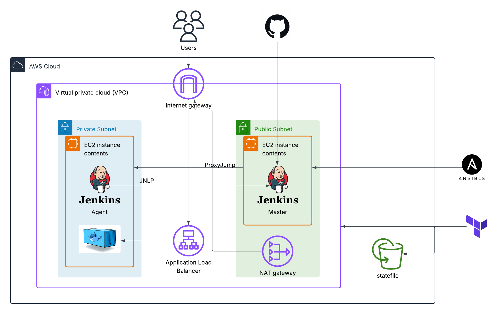

# AWS Infrastructure Management with Terraform, Ansible, and Jenkins CI/CD

This repository contains code and configurations for provisioning and managing AWS infrastructure using Terraform, configuring instances with Ansible, and implementing a CI/CD pipeline with Jenkins.

## Architecture



## Overview

- **Terraform**: Defines and provisions AWS resources such as EC2 instances, VPCs, security groups, etc.
- **Ansible**: Configures the provisioned instances, installs necessary software, and deploys applications.
- **Jenkins**: Automates the build, test, and deployment processes through a CI/CD pipeline.
- **Docker**: Used to containerize applications for consistent deployment across environments.

## CI/CD Trigger via GitHub Webhook

This project uses a GitHub webhook to trigger a Jenkins build on push.

### 🔄 Before Push


### ✅ After Push (Triggered Jenkins Job)


## Features

- **Infrastructure as Code (IaC)**: Reproducible and version-controlled infrastructure.
- **Automated Configuration**: Streamlined setup and management with Ansible.
- **CI/CD Pipeline**: Continuous integration and deployment powered by Jenkins.
- **Containerization**: Portable and scalable applications with Docker.

## Prerequisites

Before you begin, ensure you have the following:

- An AWS account with necessary permissions.
- Terraform installed on your local machine.
- Ansible installed on your local machine.
- Git installed.

## Usage

Follow these steps to set up and use the repository:

1. **Clone the Repository**

   ```bash
   git clone https://github.com/philopateermansour/aws-infra-ansible-terraform-jenkins-ci-cd.git
   cd aws-infra-ansible-terraform-jenkins-ci-cd
   ```

2. **Configure AWS Credentials** Ensure your AWS credentials are set up correctly using the AWS CLI or environment variables.

3. **Provision Infrastructure with Terraform**

   ```bash
   cd Terraform
   terraform init
   terraform plan -var-file=terrraform.tfvars
   terraform apply
   ```

   This will create the AWS resources defined in the Terraform configuration files.

4. **Configure Instances with Ansible**

   - Update the `inventory` file with the IP addresses of the provisioned instances.
   - Run the playbook:

     ```bash
     cd ../Ansible
     ansible-playbook playbook.yml
     ```

5. **Set Up Jenkins CI/CD Pipeline**

   - Access your Jenkins server at `http://<public_server_ip>:8080`.
   - Create a new pipeline job.
   - Configure it to use the `Jenkinsfile` in this repository.
   - Set up any required credentials or environment variables in Jenkins.
   - Set up webhook

6. **Deploy Applications**

   - The Jenkins pipeline will trigger automatically on code changes, building, testing, and deploying the application as defined in the `Jenkinsfile`.

## Configuration

Customize the setup as needed:

- **Terraform**: Edit `variables.tf` or other `.tf` files to adjust infrastructure settings.
- **Jenkins**: Update the `Jenkinsfile` to tweak pipeline stages and steps.

## Accessing the Infrastructure

- **SSH into EC2 Instances**:

  ```bash
  ssh -i ssh-key-pair.pem ubuntu@<instance_ip>
  ```

  Use the SSH key pair specified in Terraform.
- **Jenkins UI**: Available at `http://<jenkins_server_ip>:8080`.

## Tearing Down

To remove the provisioned infrastructure:

```bash
terraform destroy -var-file=terraform.tfvars
```

## Troubleshooting

- **Terraform Errors**: Verify AWS credentials, permissions, and syntax in `.tf` files.
- **Ansible Failures**: Check the inventory file, SSH access, and playbook syntax.
- **Jenkins Issues**: Ensure pipeline configuration, credentials, and agent connectivity are correct.
